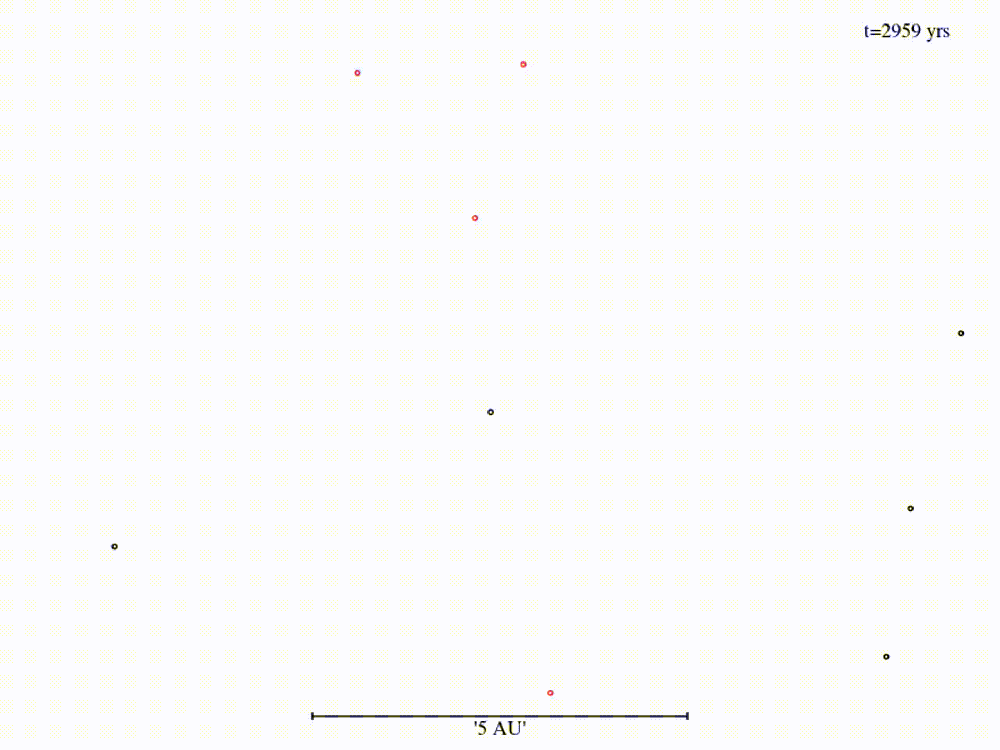

### Meeting notes - Week of 8th June 2022
---
From clump profiles we can identify 3 main groups of clumps:
- Characteristic clumps with 1st and 2nd cores (blue line)
- Clumps with weak first core (yellow line)
- Clumps with apparently no first core (green line) 

 The clump with both the first and second core and the clump with a weak first core have kind of comparible masses but the clump with no first core at all has a noticable mass discrepancy. The energies are fairly consistent across the three types of clump. The temperature and densties (which we expect to look sort of simular due to the EOS) do show some differences between the three types. Using the 'standard' clump with both first and second core as a point of reference, the clump with the weak first core is hotter outside of approx 0.1 AU and therefore has more thermal support. 
 As for the angular momemtum, the two non-standard clumps have a simular shaped plot of cumulative L with the clump with no first core having a lower value overall.
 

#### Cross sections in y of the three different types of clumps
Characteristic| Weak fc | No fc
:--------:|:------:|:-------:|
 |  | 

 The clumps with a weak first core and with no first core at all are more extended with a disc about them.

### Clumps with no first core
---
From the simulations with 1M particles, clumps 3, 4, 11 and 12 show weak or no evidence of a first core. The equation of state parameters are:
Quantity| Value|
:--------:|:------:
rho crit 1  | 5.000E-13
rho crit 2  | 1.581E-11
rho crit 3  | 2.828E-08
$\gamma_{1}$ | 1.667
$\gamma_{2}$ | 1.400
$\gamma_{3}$ | 1.100
#### Profiles of clumps with no or a weak first core

 I need to plot these clumps with different values on the graph thats shows M,R and L as a function of R. You can actually see than the blue and yellow lines (clumps 3 and 4) do have weak first cores rather than no core at all and these two do trace one another in all 7 of the above plots. It it hard to make out on these plots but perhaps there is a subgroup that seperates the green and red lines or maybe its just a question of mass. I want to explore this a bit more, like where to the clumps with no first core form in the disc and at what **time**?
.

### All clumps M,R and L as a function of R
---

##### Few things to note here
---
- No clear dependance on EOS?
- Quite a few clumps without first cores (zeros in top two plots)
- Still have obviously discrete values for 2nd core radius
- 3 grouping in second core mass. 
##### I am still playing around with this so its not final.

I was playing around by plotting the particles in spherical coords and seeing the spirals develop. Since spirals with constance pitch angle are indicative of gravitational instability (https://ui.adsabs.harvard.edu/abs/2018ApJ...860L...5F/abstract) I thought it would be cool to see them going from gravitational instability spirals to planet driven ones with pitch angles increasing with radius. The video is quite large so you can view it on the website (http://www.star.uclan.ac.uk/~afenton/Downloads.html)

##### Also been writing some bits in the numerical hydrodynamics chapter, you can see that on overleaf.
